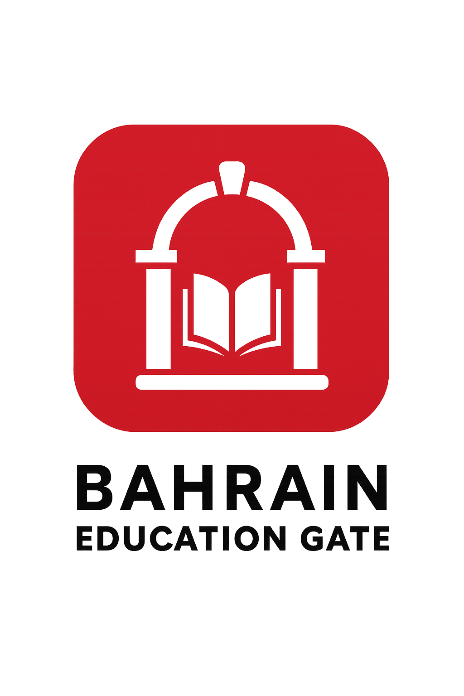

# Welcome to Bahrain Education Gate 
Bahrain Education Gate is a secure platform for schools to manage courses, assignments, and student access. School admins can create and edit content, while students view and submit assignments linked to their courses. The app uses role-based access and JWT authentication to keep everything organized and protected

## Getting Started
- Deployed App <a>https://bahrain-education-gate.vercel.app/</a>
- Trello for planning <a>https://trello.com/b/JEWNd0kK/group-project-3-ga</a>
- Backend <a>https://github.com/Ahussainmoosa/Login-Auth-Backend</a>

## Technologies Used
- JavaScript
- EJS/Express
- React
- CSS

## Next Steps
- Add enroll students feature.
- Improve CSS.
- Gamification. 
- Track assignment dates.
- Admin Dashboard.

